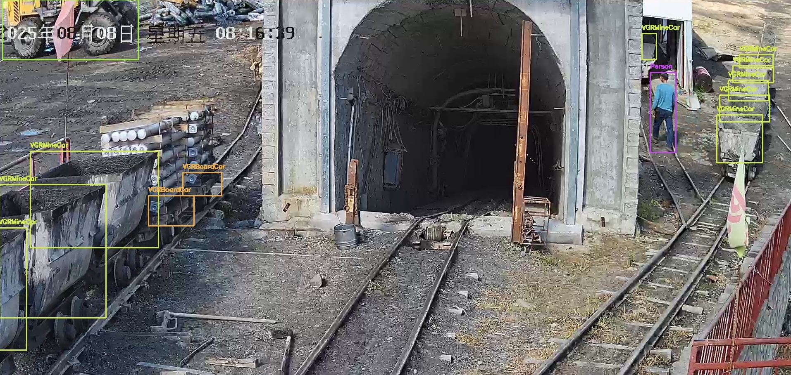

# pytorch-toolkit-dev
building a multitask training platform based on Pytorch

## Introduction

yolo-dev branch for object detection tasks.

    

### Supported Functions

- [x] Detect/Segment/Track object by YOLOv[8-11].
- [x] Convert model to ONNX/Tensorrt.
- [x] Support videos and images' inference.
- [x] Support ignore regions for detect task.
- [x] Support visualized badcase.

### Major Motivation

1.👀 Use the State-of-the-Art AI-detection toolkit.
 + Various backbones and pretrained models
 + Bag of training tricks
 + Large-scale training configs
 + High efficiency and extensibility
 + Powerful toolkits

2.🚀 Enhance codes' reusability.

3.🛠️ Minimize our project.

## Quick Start

### Install Environment

For detailed installation guides, please refer to [INSTALL.md](docs/INSTALL.md).

### Command Guides

+ Train & Validate with Training Curve

Refer to [README-Train/Val Models](tools/README.md) for details.

## License

This project is released under the [Apache 2.0 license](LICENSE).

## Contribute

Feel free to create a pull request if you want to contribute (e.g. networks or tricks).
