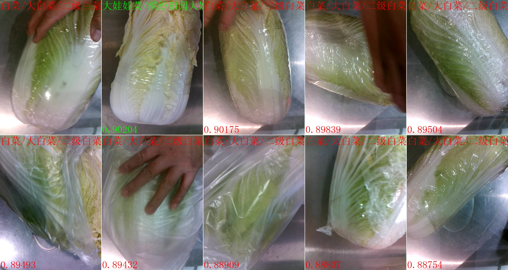

# pytorch-toolkit-dev

building a multitask training platform based on Pytorch

## Introduction

cls-dev branch for classfication or re-identification tasks.

    

### Supported Functions

- [x] Classfication (Single-label, Multi-label) and Re-identification tasks.
- [ ] Metric learning for Re-identification.
- [x] Visualize training curve (wandb / tensorboard).
- [x] Remove similarity or noise data, weighted k-nearest neighbor for reid.
- [ ] Visualize Precision-Recall / Receiver-Operating-Characteristic curve.
- [x] Mixed-Precision Training for faster speed.
- [x] Visualize models' heatmaps and U-MAPs.
- [x] Convert pth model to onnx / rknn / ncnn format.

### Major Motivation

1.👀 Use the State-of-the-Art image classfication toolkit.
 + Various backbones and pretrained models
 + Bag of training tricks
 + Large-scale training configs
 + High efficiency and extensibility
 + Powerful toolkits

2.🚀 Enhance codes' reusability.

3.🛠️ Minimize our project.

## Quick Start

### Install Environment

For detailed installation guides, please refer to [INSTALL.md](docs/INSTALL.md).

### Command Guides

+ Train & Validate with Training Curve

Refer to [README-Train/Val Models](tools/README.md) for details.

+ Convert Pth Model To ONNX/RKNN

Refer to [README-Convert Models](tools/deploy/README.md) for details.

## License

This project is released under the [Apache 2.0 license](LICENSE).

## Contribute

Feel free to create a pull request if you want to contribute (e.g. networks or tricks).
